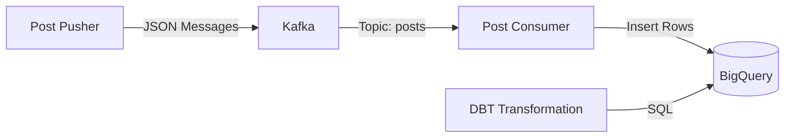

# Data DevOps Data Pipeline

## Overview
This project implements a complete data pipeline on Kubernetes, connecting a data producer to Google BigQuery via Kafka, with transformations managed by DBT and deployment managed by ArgoCD (GitOps).

## Architecture


## Deployment Components
All Kubernetes manifests are located in the `k8s/` directory and managed via ArgoCD.

*   **Infrastructure**: Kafka, Kafka UI
*   **Apps**: Post Pusher, Post Consumer
*   **GitOps**: ArgoCD
*   **Resilience**: The `post_pusher` logic is decoupled from BigQuery. If the database is down, Kafka buffers the messages, ensuring no data loss.

## CI/CD Pipeline (GitHub Actions)
Every push to `main` triggers a workflow that:
1.  Builds Docker images for `post_pusher` and `post_consumer`.
2.  Pushes them to **GitHub Container Registry (GHCR)**.
3.  ArgoCD detects the new images (if tags change or if set to Always pull) and updates the cluster.

## Setup & Installation

### 1. Prerequisites
*   Kubernetes Cluster (Kind or K3s)
*   Google Cloud Service Account (`service-account.json`) with BigQuery Admin roles.


### 2. Secrets Management (Important)
The consumer requires a GCP key to write to BigQuery.
**Do not commit this key.** Instead, create the secret manually:
```bash
kubectl create secret generic google-cloud-key --from-file=key.json=service-account.json
```


### 3. Deploy via ArgoCD (Recommended)
The project is configured to sync automatically using the GitOps pattern.
1.  **Install ArgoCD**: Deployed in `argocd` namespace.
2.  **Sync**: The `data-pipeline` Application watches the `k8s/` folder of this repository.

### 4. Manual Deployment (Optional)
If you prefer to deploy components manually without ArgoCD:
```bash
# 1. Infrastructure (Kafka & UI)
kubectl apply -f k8s/kafka-deployment.yaml
kubectl apply -f k8s/kafka-service.yaml
kubectl apply -f k8s/kafka-ui-deployment.yaml
kubectl apply -f k8s/kafka-ui-service.yaml

# 2. Configuration
kubectl apply -f k8s/post_pusher-configmap.yaml
kubectl apply -f k8s/post_consumer-configmap.yaml

# 3. Applications
kubectl apply -f k8s/post_pusher-deployment.yaml
kubectl apply -f k8s/post_consumer-deployment.yaml
```


## Usage Guide

### 🅰️ Accessing ArgoCD
Monitor your deployment status.
```bash
# 1. Port Forward
kubectl port-forward svc/argocd-server -n argocd 8080:443

# 2. Open Browser
# https://localhost:8080
# User: admin
# Password: (Get from secret: kubectl -n argocd get secret argocd-initial-admin-secret -o jsonpath="{.data.password}" | base64 -d)
```

### 🅱️ Running DBT (Transformations)
To execute the SQL transformations (calculate average scores from the raw posts):
```bash
# Run generic model
docker run --rm -v $(pwd):/usr/app -w /usr/app ghcr.io/dbt-labs/dbt-bigquery:latest run --project-dir dbt_transform --profiles-dir dbt_transform
```

### 🅲 Accessing Kafka UI
Debug message flow.
```bash
kubectl port-forward svc/kafka-ui 8081:8080
# Access at http://localhost:8081
```

## 🆘 Disaster Recovery (Full Reset)
If the cluster is broken and you need to restart from scratch:

1.  **Destroy Cluster**:
    ```bash
    kind delete cluster
    ```

2.  **Rebuild Infrastructure**:
    ```bash
    kind create cluster --config kind/config.yaml
    kubectl create namespace argocd
    kubectl apply -n argocd -f https://raw.githubusercontent.com/argoproj/argo-cd/stable/manifests/install.yaml
    ```

3.  **Wait** for ArgoCD pods to start.

4.  **Restore Secrets & App**:
    ```bash
    kubectl create secret generic google-cloud-key --from-file=key.json=service-account.json
    kubectl apply -f argocd/application.yaml
    ```